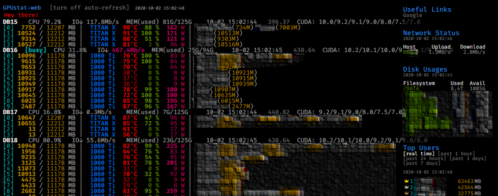
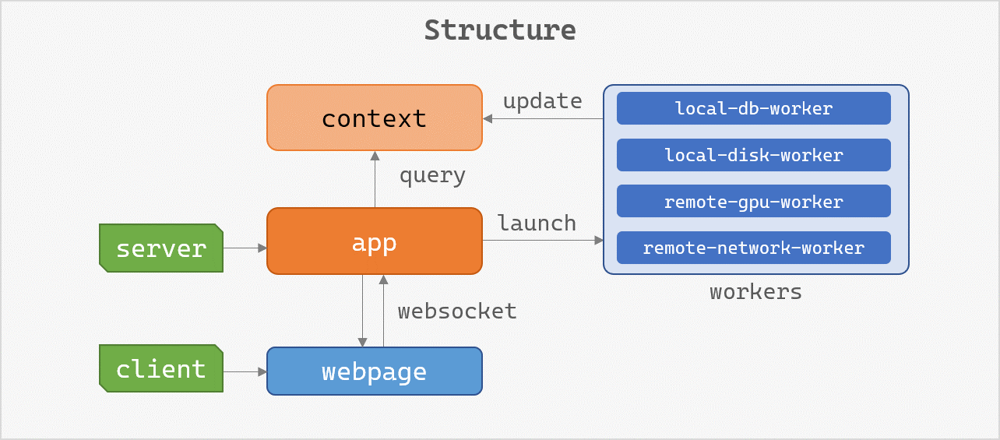

# GPUstat-web-enhanced

Enhanced [gpustat-web](https://github.com/wookayin/gpustat-web), a web interface of gpustat -- aggregating gpustat across multiple nodes.

## Improvements

 - Add cpu, memory, network and cuda infomation
 - Add GPU usage rankings using `sqlite`
 - Arrange the codes in an extensible way (try implementing another `worker`!)

## Requirements

#### Server: 

* Python 3
* gpustat_web
* aiosqlite

#### Nodes:

* sysstat
* gpustat

## Installation

 1. Download this repo
 2. Install required python packages
 3. Run `python app.py`

## Structure

## Notes

  This project is in alpha version.

## To-do

 - [ ] Re-arrange the context and workers.
 - [ ] Modify the `Worker` class. 
 - [ ] Nicer HTML file.
 - [ ] Detailed installation instructions.

## Acknowledge

 - [gpustat-web](https://github.com/wookayin/gpustat-web)
